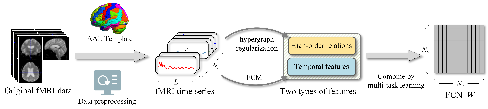

# Hyper-FCM
#### The code and preprocessed data for "Hypergraph-Based Fuzzy Cognitive Maps for Functional Connectivity Analysis on fMRI Data"

Fig.1. The flowchart of an FCN constructed by Hyper-FCM.
  
 
The <strong>supplementary material</strong> is available at https://github.com/IngeTeng/Hyper-FCM/blob/main/MedIMA-SI.pdf
